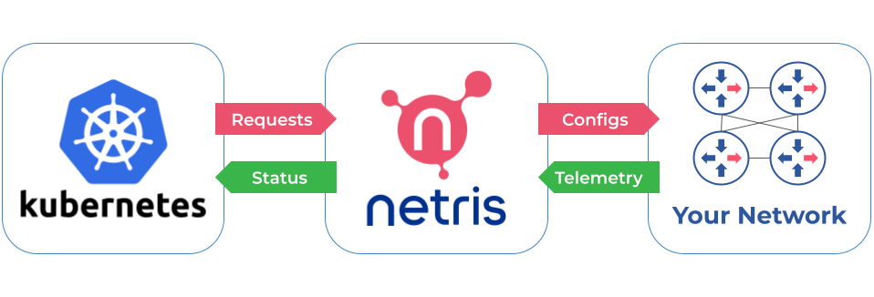

# Netris Operator

[Netris Operator](https://github.com/netrisai/netris-operator) is a Kubernetes Operator for managing and automating tasks related to managing a Netris Cloud.

[Netris](https://netris.ai) is an automatic netops platform that turns your physical network into a service. Netris uses application service metadata, simple rules, and an understanding of the organizational structure to satisfy your applications’ connectivity needs. Netris ensures that your applications can communicate through continuous monitoring and analyses, and remediates any anomalies that may arise, resulting in up to a 90% reduction in ops time, and also reducing ops costs by up to 80%. 

## Deploying the Operator
The current version of netris-operator requires Kubernetes >= 1.16.

### GitOps
Kubernetes manifests are located in the `deploy/` folder. To deploy the operator manually using Kubernetes manifests or to integrate it into your GitOps flow please follow [these instructions](./deploy/). 

### Helm Charts

You can also use [Helm charts](./deploy/charts/netris-operator) to deploy Netris Operator.
## Documentation
Netris Operator managing resources samples are available in the `samples/` [folder](./samples/).

## Compatibility with Netris-Controller
  | Operator version | Controller version |
  | -----------------| -------------------|
  | `v0.X`           | `v2.9`             |
  | `v1.X`           | `v3.0`             |
  | `v2.X`           | `v3.1+`            |

## Features
* Managing Netris Controller via CRD
* Automatically creating `L4LB` resource for `type: load-balancer` services
* Integration with CNI:
  |            |                      |
  | -----------| ---------------------|
  | `Calico`   | `Ready`              |
  | `Cilium`   | *`In progress`*      |
  | `Flannel`  | *`In progress`*      |
  

